# Compute Lidar Point-Cloud from Range Image
## ID_S1_EX1 - Visualize Range Image Channels
* See code in objdet_pcl.py lines 69 - 111.
* Run code, or open image "range_image.png" for an example.
* 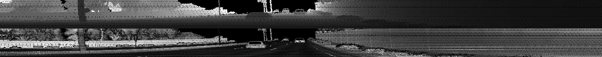

## ID_S1_EX2 - Visualize Point-Cloud
### Generic visualization
* See code in objdet_pcl.py lines 35 - 66.
* Run code to visualize a point-cloud, or open image "point-cloud_1.png" for an example.
* 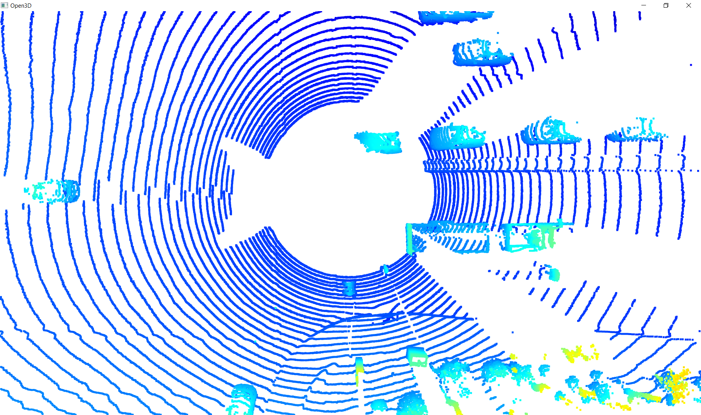

### Examples of vehicles with varying degrees of visibility
1. Image "PCL_1.png" from frame 0 from sequence 1 shows four vehicles in front of the Lidar, all driving on the same side of the road. For each of these four vehicles the rear of the vehicle is clearly visible in the point-cloud. For the two vehicles in the middle the wheels and the rear window can be identified as well.  
* 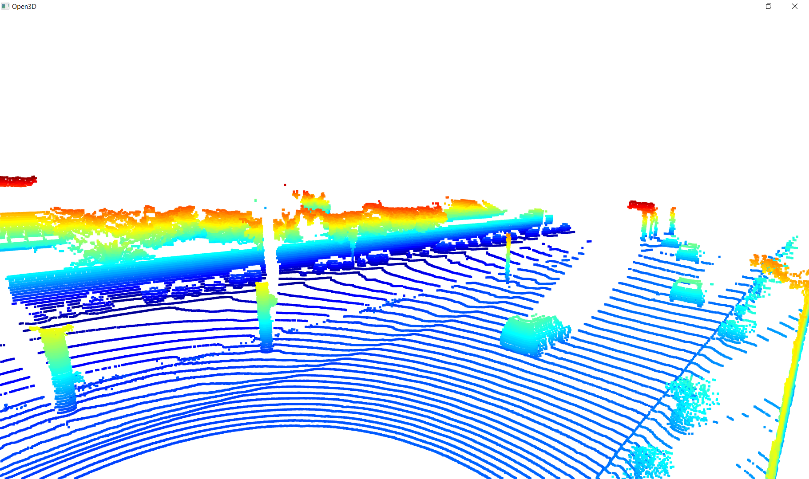  
2. Image "PCL_2.png" from frame 0 from sequence 1 shows two vehicles. One vehicle behind the Lidar driving on the same side of the road, and one vehicle (a truck) behind the Lidar on the other side of the road. The wheels and the bed of the truck are clearly visible. When rotating the camera, the front bumper and the wheels of the vehicle drivng on the same side of the road can be identified as well.
* 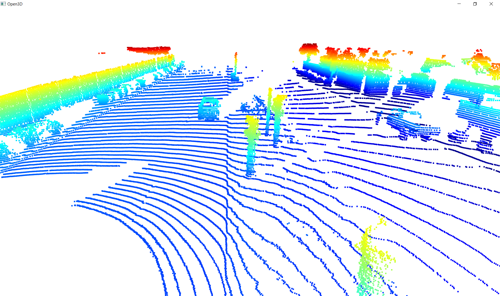
3. Image "PCL_3.png" from frame 100 from sequence 1 shows four vehicles in front of the Lidar, all driving on the same side of the road. For the closest three vehicles the wheels and back of the vehicles can be identified. For the closest two vehicles, driving just to the left of the center of the Lidar, the sides of the vehicles can be identified as well.
* 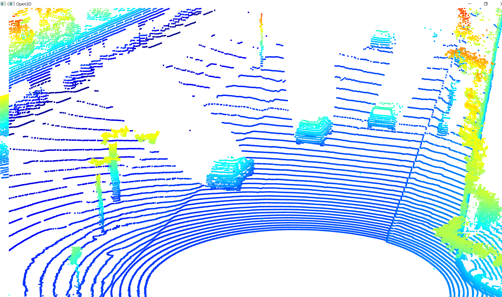
4. Image "PCL_4.png" from frame 150 from sequence 1 shows four vehicles in front of the Lidar, all driving on the same side of the road. For the closest three vehicles the wheels and back of the vehicles can be identified. Same as for the previous picture, for the closest two vehicles, driving just to the left of the center of the Lidar, the sides of the vehicles can be identified as well.
* 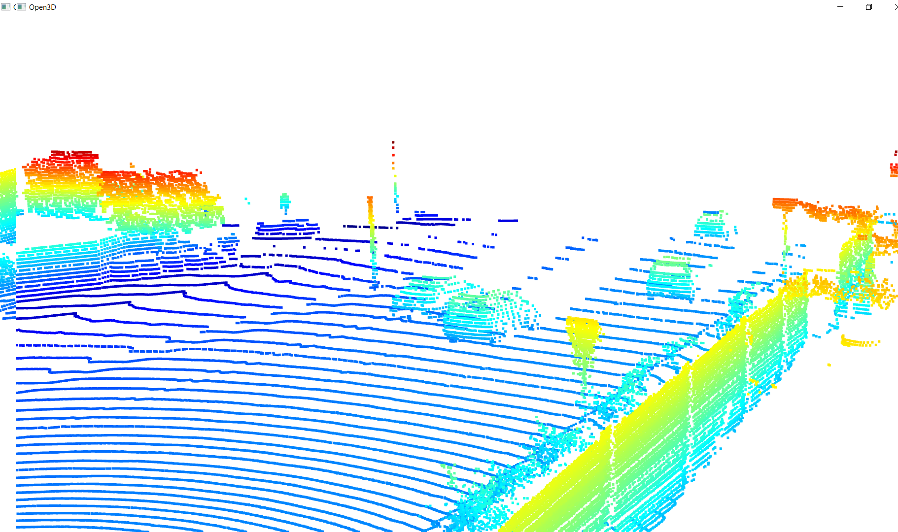
5. Image "PCL_4_range_image.png" from the same frame 150 from sequence one. Between the range channel (top half of the image) and the intensity channel (bottom half of the image) all four vehicles are clearly visible. Surprisingly, the left most vehicle is less visible in the bottom half of the image, generated using information from the intensity channel.
* 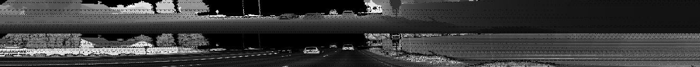

### Examples of stable vehicle features
The following is a list of vehicle features that appear - in the point-cloud - as stable features on most vehicles:
* front of vehicles driving behind the Lidar
* rear of vehicles driving in front of the Lidar
* wheels of vehicles driving in front of / or behind the Lidar
* sides of vehicles driving with an offset versus the center of the Lidar 

# Create Birds-Eye View from Lidar Point-Cloud
## ID_S2_EX1 - Convert Sensor Coordinates to BEV-map Coordinates
* See code in objdet_pcl.py lines 115 - 150.
* Change value of show_point_cloud to TRUE in order to display point-cloud.
* Run code or open image "point-cloud-BEV.png" for an example.
* 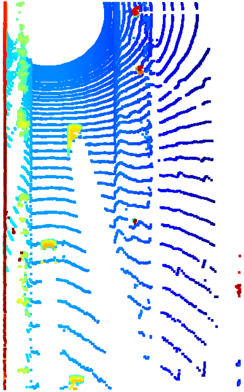

## ID_S2_EX2 - Compute Intensity Layer of BEV-map
* See code in objdet_pcl.py lines 153 - 192.
* Change value of show_intensity_map to TRUE in order to display intensity map.
* Run code or open image "img-intensity.png" for an example.
* 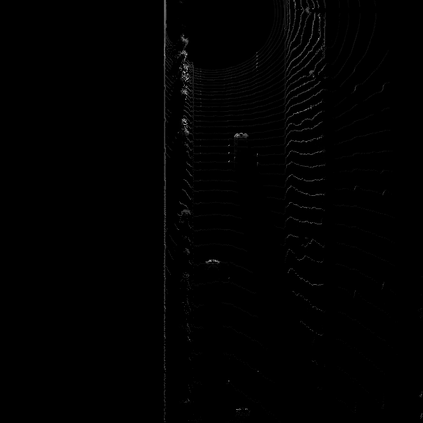

## ID_S2_EX3 - Compute Height Layer of BEV-map
* See code in objdet_pcl.py lines 196 - 228.
* Change value of show_height_map to TRUE in order to display height map.
* Run code or open image "img-height.png" for an example.
* 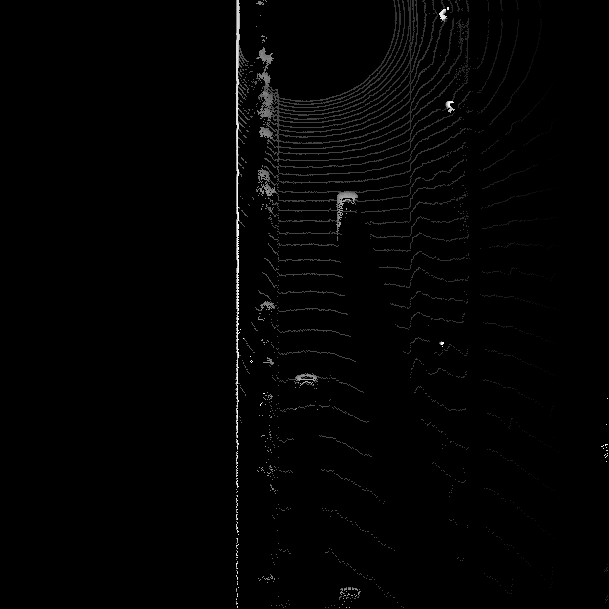

# Model-Based Object Detection in BEV Image
## ID_S3_EX1 - Add a Second Model from a Github Repo
* Change model_name to 'fpn_resnet' in line 65 in loop_over_dataset.py.
* See code in objdet_detect.py lines 61 - 89, lines 142 - 150, lines 194 - 210 and lines 239 - 240.
* Add breakpoint in object_detect.py line 217.
* Run code and inspect "detections" or open image "fpn_resnet_detections.png".
* 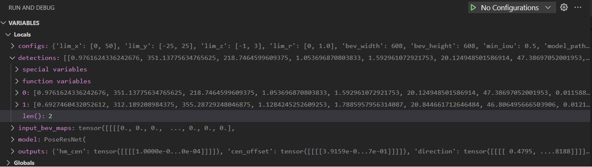
* NOTE: There is a small delta between the values for the 2 detections in the picture above versus the values in the picture included in the project instructions.

## ID_S3_EX2 - Extract 3D Bounding Boxes from Model Response
* See code in objdet_detect.py lines 214 - 234.
* NOTE: See code commented out in misc.objdet_tools lines 203 - 213 and lines 238 - 239.
* Run code or open image "bev_labels_in_camera.png"
* 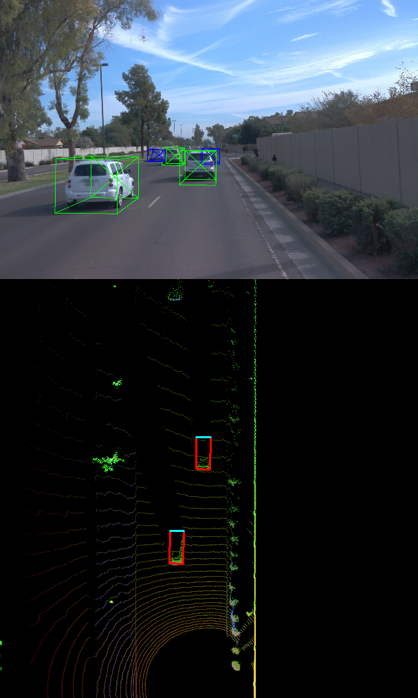

# Performance Evaluation for Object Detection
## ID_S4_EX1 - Compute Intersection-Over-Union Between Labels and Detections
* See code in objdet_eval.py lines 48 - 94.
* Add breakpoint in objdet_eval.py line 105.
* Run code and inspect "ious" and "center_devs" or open image "ious.png" and image "center_devs.png".
* 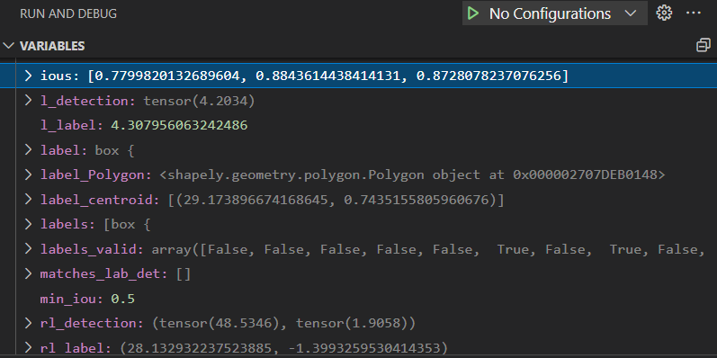
* 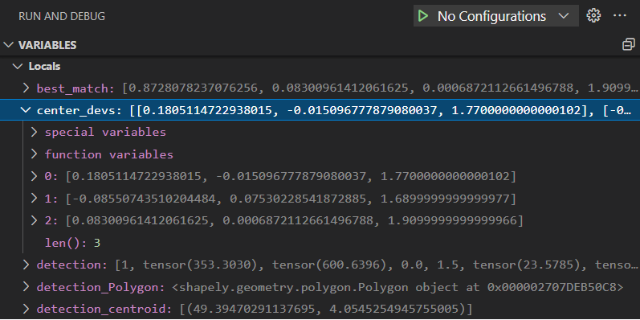
* NOTE: Results / values do not agree with the results / values in the pictures included in the project instructions.
* NOTE: Very large offsets in the z-direction in "center_devs" as detections always stores a value of 0.0 for z in objdet_detect.py line 189.

## ID_S4_EX2 - Compute False-Negatives and False-Positives
* See code in objdet_eval.py lines 103 - 122.
* Add breakpoin in objdet_eval.py line 127.
* Run code and inspect "det_performance" or open image "det_performance.png".
* 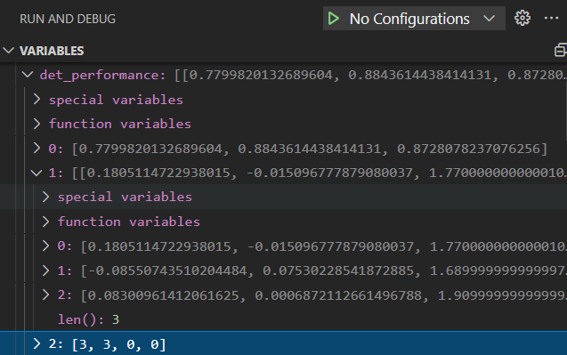
* NOTE: Unlike the picture included in the project instructions, my code identified 3 true positives and 0 false negatives.

## ID_S4_EX3
* See code in objdet_eval.py lines 142 - 159.
* When setting configs_det.use_labels_as_objects = True in loop_over_dataset.py I did not get the expected results. I believe this is because setting this variable to True results in detection values expressed in meters, whereas my code in objdet_eval.py lines 68 - 71 expects values in BEV pixels.
* Run code or open image "precision_recall_darknet.png".
* The terminal reported the following values: precision = 0.950819672131, recall = 0.947712418.  
* 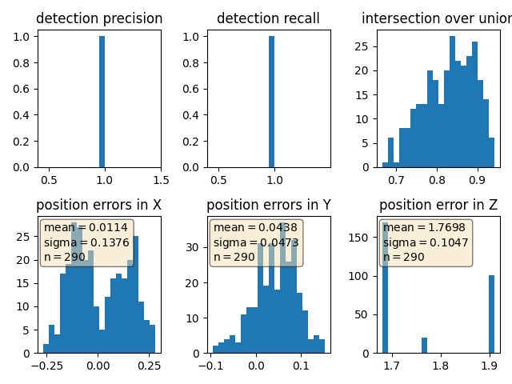
* NOTE: These results do not agree with the picture included in the project instructions. 
* NOTE: The distribution of position error in x unexpectedly looks like a bi-model distribution.
* NOTE: The distribution of position error in z looks to only contain three values.