# Compute Lidar Point-Cloud from Range Image
## ID_S1_EX1 - Visualize Range Image Channels
* See code in objdet_pcl.py lines 69 - 111.
* Run code, or open image "range_image.png" for an example.
* 

## ID_S1_EX2 - Visualize Point-Cloud
### Generic visualization
* See code in objdet_pcl.py lines 35 - 66.
* Run code to visualize a point-cloud, or open image "point-cloud_1.png" for an example.
* 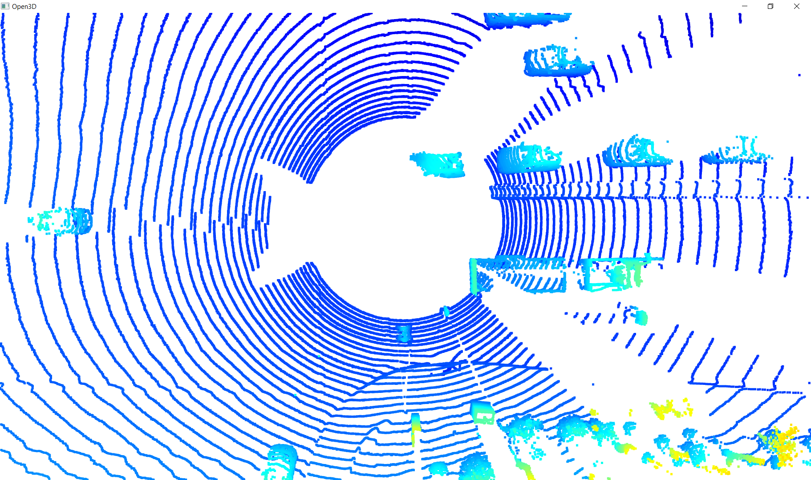

### Examples of vehicles with varying degrees of visibility
1. Image "PCL_1.png" from frame 0 from sequence 1 shows four vehicles in front of the Lidar, all driving on the same side of the road. For each of these four vehicles the rear of the vehicle is clearly visible in the point-cloud. For the two vehicles in the middle the wheels and the rear window can be identified as well.  
* 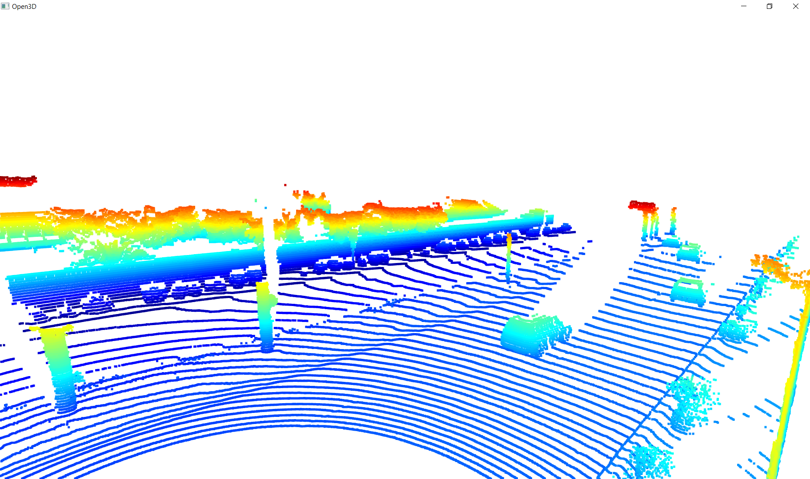  
2. Image "PCL_2.png" from frame 0 from sequence 1 shows two vehicles. One vehicle behind the Lidar driving on the same side of the road, and one vehicle (a truck) behind the Lidar on the other side of the road. The wheels and the bed of the truck are clearly visible. When rotating the camera, the front bumper and the wheels of the vehicle drivng on the same side of the road can be identified as well.
* 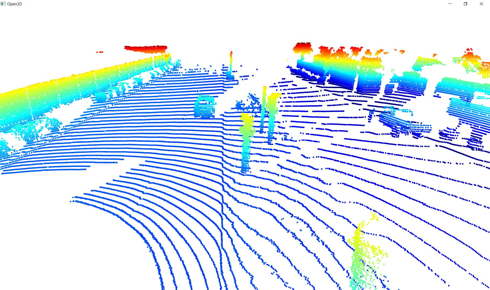
3. Image "PCL_3.png" from frame 100 from sequence 1 shows four vehicles in front of the Lidar, all driving on the same side of the road. For the closest three vehicles the wheels and back of the vehicles can be identified. For the closest two vehicles, driving just to the left of the center of the Lidar, the sides of the vehicles can be identified as well.
* 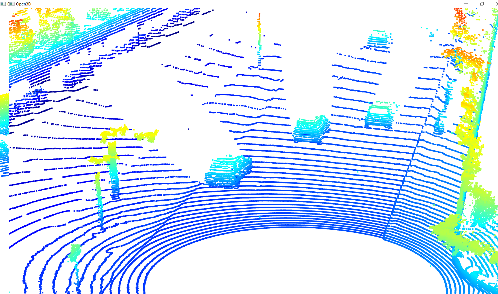
4. Image "PCL_4.png" from frame 150 from sequence 1 shows four vehicles in front of the Lidar, all driving on the same side of the road. For the closest three vehicles the wheels and back of the vehicles can be identified. Same as for the previous picture, for the closest two vehicles, driving just to the left of the center of the Lidar, the sides of the vehicles can be identified as well.
* 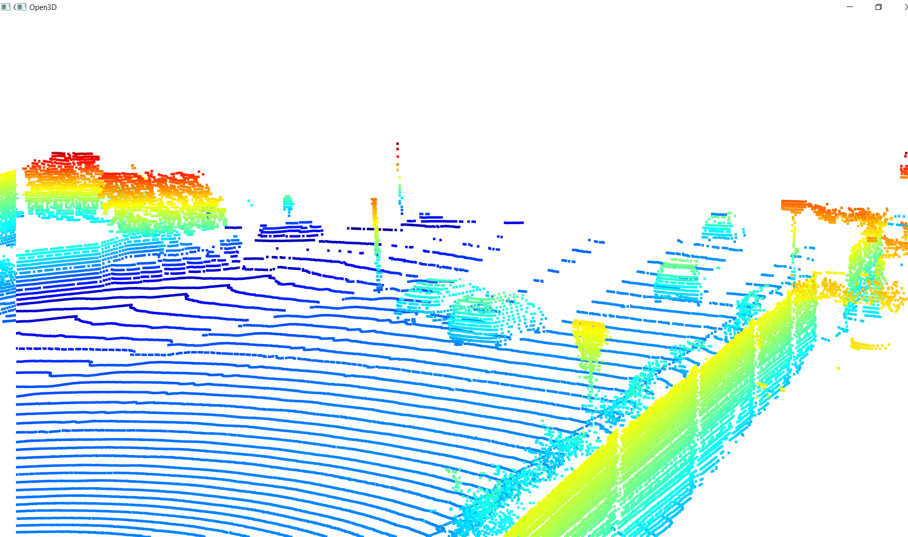
5. Image "PCL_4_range_image.png" from the same frame 150 from sequence one. Between the range channel (top half of the image) and the intensity channel (bottom half of the image) all four vehicles are clearly visible. Surprisingly, the left most vehicle is less visible in the bottom half of the image, generated using information from the intensity channel.
* 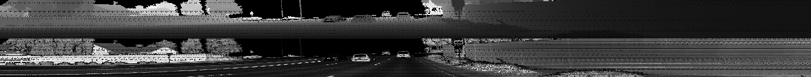

### Examples of stable vehicle features
The following is a list of vehicle features that appear - in the point-cloud - as stable features on most vehicles:
* front of vehicles driving behind the Lidar
* rear of vehicles driving in front of the Lidar
* wheels of vehicles driving in front of / or behind the Lidar
* sides of vehicles driving with an offset versus the center of the Lidar 

# Create Birds-Eye View from Lidar Point-Cloud
## ID_S2_EX1 - Convert Sensor Coordinates to BEV-map Coordinates
* See code in objdet_pcl.py lines 115 - 150.
* Change value of show_point_cloud to TRUE in order to display point-cloud.
* Run code or open image "point-cloud-BEV.png" for an example.
* 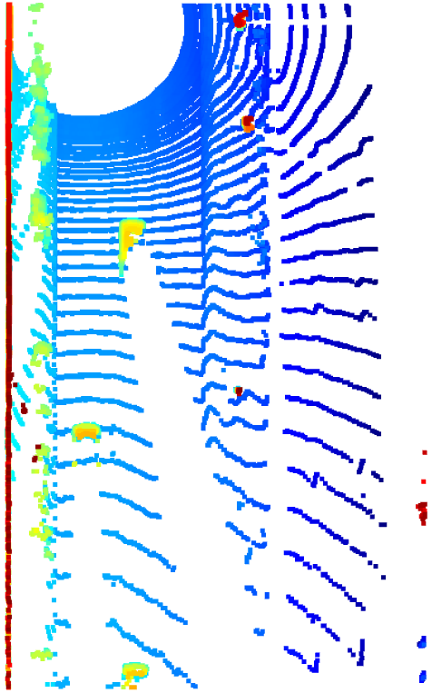

## ID_S2_EX2 - Compute Intensity Layer of BEV-map
* See code in objdet_pcl.py lines 153 - 192.
* Change value of show_intensity_map to TRUE in order to display intensity map.
* Run code or open image "img-intensity.png" for an example.
* 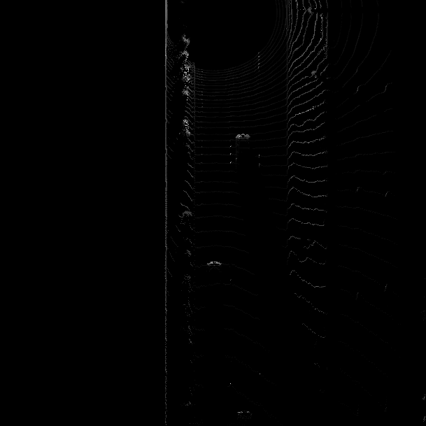

## ID_S2_EX3 - Compute Height Layer of BEV-map
* See code in objdet_pcl.py lines 196 - 228.
* Change value of show_height_map to TRUE in order to display height map.
* Run code or open image "img-height.png" for an example.
* 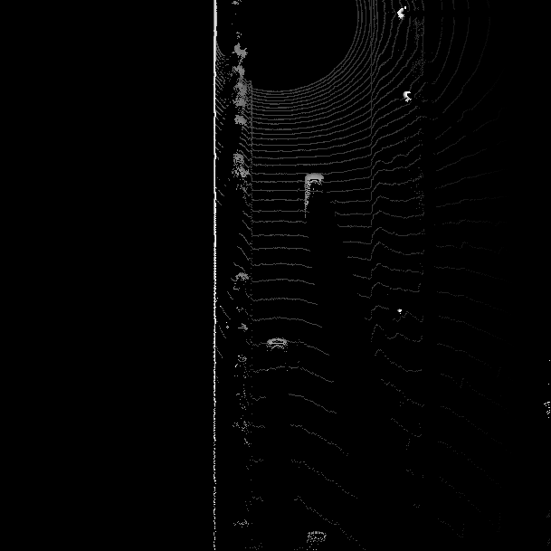

# Model-Based Object Detection in BEV Image
## ID_S3_EX1 - Add a Second Model from a Github Repo
* Change model_name to 'fpn_resnet' in line 65 in loop_over_dataset.py.
* See code in objdet_detect.py lines 61 - 89, lines 142 - 150, lines 194 - 210 and lines 239 - 240.
* Add breakpoint in object_detect.py line 217.
* Run code and inspect "detections" or open image "fpn_resnet_detections.png".
* 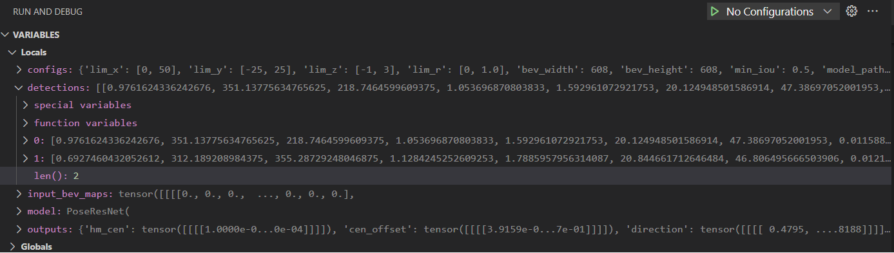
* NOTE: There is a small delta between the values for the 2 detections in the picture above versus the values in the picture included in the project instructions.

***UPDATES AFTER REVIEW: I added additional configurations, as suggested in the review comments in lines 88 - 119, then commented out the duplictates. This did not appear to change any of the values for the 2 detections. (Note that some of the line numbers referenced above - as part of the original submission - may have changed, due to changes made as part of the updates included in the 2nd submission.)***

## ID_S3_EX2 - Extract 3D Bounding Boxes from Model Response
* See code in objdet_detect.py lines 214 - 234.
* NOTE: See code commented out in misc.objdet_tools.py lines 203 - 213 and lines 238 - 239.
* Run code or open image "bev_labels_in_camera.png"
* 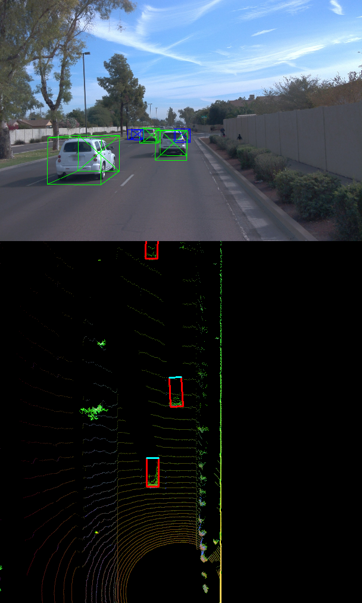

***UPDATES AFTER REVIEW: I uncommented out the code in misc.objdet_tools.py lines 203 - 213 and line 238. Therefore, function project_detections_into_bev in misc.objdet_tools.py expects detections in BEV pixel coordinates again. Next, I added the code provided in the review comments in objdet_detect.py lines 251 - 267. The transformation is straightforward with two noteworthy exceptions, (1) effectively mapping bev_x to metric y and bev_y to metric x, and (2) making sure that bev_x = 0 corresponds to metric y = -25 m. This did not appear to change visualization of the detections. (Note that some of the line numbers referenced above - as part of the original submission - may have changed, due to changes made as part of the updates included in the 2nd submission.)***  

# Performance Evaluation for Object Detection
## ID_S4_EX1 - Compute Intersection-Over-Union Between Labels and Detections
* See code in objdet_eval.py lines 48 - 94.
* Add breakpoint in objdet_eval.py line 105.
* Run code and inspect "ious" and "center_devs" or open image "ious.png" and image "center_devs.png".
* 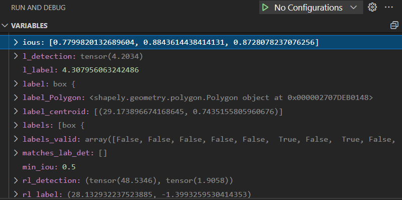
* 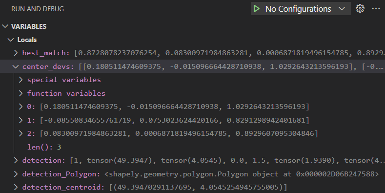
* NOTE: Results / values do not agree with the results / values in the pictures included in the project instructions.
* NOTE: Very large offsets in the z-direction in "center_devs" as detections always stores a value of 0.0 for z in objdet_detect.py line 189.

***UPDATES AFTER REVIEW: Due to the changes made in misc.objdet_tools.py and in objdet_detect.py (both described above), detections are now stored in metric values rather than in BEV pixel coordinates. I cleaned up the code in lines 43 - 87 in objdet_eval.py and realized I had made a mistake in the calculation of dist_z. This did not appear to change any of the values in "ious", but did change values in "center_devs". The picture "center_devs.png" shown above is the updated picture. (Note that some of the line numbers referenced above - as part of the original submission - may have changed, due to changes made as part of the updates included in the 2nd submission.)*** 

## ID_S4_EX2 - Compute False-Negatives and False-Positives
* See code in objdet_eval.py lines 103 - 122.
* Add breakpoin in objdet_eval.py line 127.
* Run code and inspect "det_performance" or open image "det_performance.png".
* 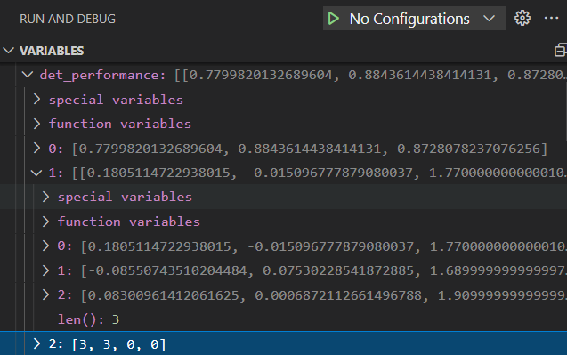
* NOTE: Unlike the picture included in the project instructions, my code identified 3 true positives and 0 false negatives.

***UPDATES AFTER REVIEW: I corrected the calculation of all_positives, by using the ground truth labels (in labels_valid), rather than using the total number of detections. I updated the calculation of false_negatives, by taking the difference between ground truth labels (in all_positives) and the number of detections (leveraging the lenght of true_positives rather than the lenght of ious). Finally, I updated the calculation of false positives, by taking the difference between the total number of detections and the total number of true positives (where the iou exceeds minimum iou threshold). (Note that some of the line numbers referenced above - as part of the original submission - may have changed, due to changes made as part of the updates included in the 2nd submission.)***

## ID_S4_EX3
* See code in objdet_eval.py lines 142 - 159.
* When setting configs_det.use_labels_as_objects = True in loop_over_dataset.py I did not get the expected results. I believe this is because setting this variable to True results in detection values expressed in meters, whereas my code in objdet_eval.py lines 68 - 71 expects values in BEV pixels.
* Run code or open image "precision_recall_darknet.png".
* The terminal reported the following values: precision = 0.950819672131, recall = 0.947712418.  
* 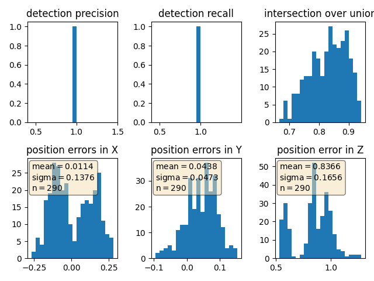
* NOTE: These results do not agree with the picture included in the project instructions. 
* NOTE: The distribution of position error in x unexpectedly looks like a bi-model distribution.
* NOTE: The distribution of position error in z looks to only contain three values.

***UPDATES AFTER REVIEW: When setting configs_det.use_labels_as_objects = True, I now get the expected results. I believe this is because of the changes made in misc.objdet_tools.py and in objdet_detect.py (both described above), detections are now stored in metric values rather than in BEV pixel coordinates. The change made to the calculation of dist_z has now resulted in a distribution for the position error in z that also - somehwat - looks like a bi-model distribution. (Note that some of the line numbers referenced above - as part of the original submission - may have changed, due to changes made as part of the updates included in the 2nd submission.)***