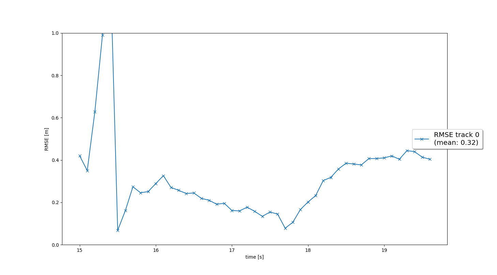
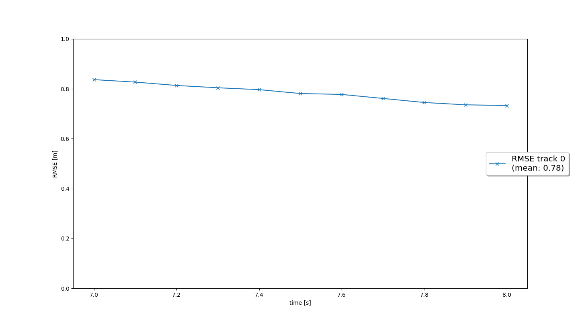
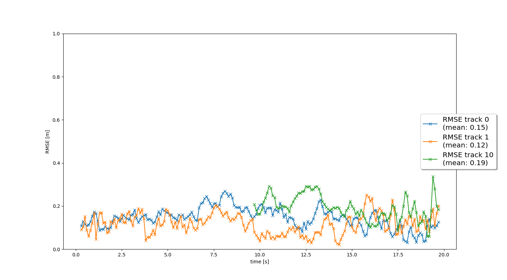
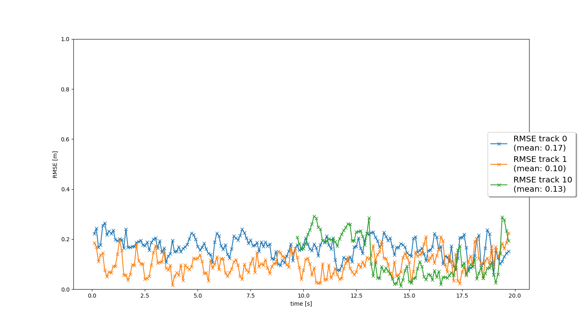

# Writeup: Track 3D-Objects Over Time

Please use this starter template to answer the following questions:

### 1. Write a short recap of the four tracking steps and what you implemented there (filter, track management, association, camera fusion). Which results did you achieve? Which part of the project was most difficult for you to complete, and why?

## Tracking
* In this first step I implemented the EKF equations as the methods of the Filter class. The predict step is implemented using the predict method and predicts the state vector x and the covariance P at the next time increment. The update step is implemented using the update method and uses a measurement to update the state vector x and the covariance P.
* The gamma method of the Filter class is already set up to support the nonlinear measurement function that will be used to integrate camera measurements in step 4.
* The graph below indicates that a single target is "tracked" and the mean Root Mean Square Error between the estimated state and the ground truth state is 0.32 m.
* 

## Track Management
* In this second step I implemented a track manager to intialize tracks, to set a track score and a track state, and to delete tracks, using the methods of the Trackmanagement class.  
* The graph below indicates that a single target is tracked and the mean Root Mean Square Error between the estimated state and the ground truth state is 0.78 m.
* 
* The animation and the terminal output both show that after initialization the track state quickly transitions from 'initialized' to 'tentative' to 'confirmed'. However, unlike as stated in the project instructions and in the project rubric, the track score never reduces and therefore the track is never deleted. 

## Data Association
* In this third step I implemented single nearest neighbor data association to associate measurements to tracks using the methods of the Association class. The associate method populates an association matrix using the Mahalanobis distances between the different measurements and tracks. The gating method is used to confirm if a distance lies inside the gate or not.
* The graph below indicates that track 0 and track 1 are tracked throughout the entire sequence, with a mean RMSE between the estimated state and the ground truth state of 0.15 m and 0.12 m respectively. A third track, track 10, is tracked throughout the second half of the sequence and has a mean RMSE between the estimated state and the ground truth state of 0.19 m.  
* 
* The animation and the terminal output both show that at various points during the sequence additional tracks are initialized. However, these other tracks are always deleted and never transition to the 'confirmed' track state.  

## Sensor Fusion
* In the fourth step I implemented the in_fov method of the Sensor class to determine if a particular object is within the Field of View of a sensor, I implemented the nonlinear camera measurement function in the get_hx method of the Sensor class, and removed the restriction to only accept LiDAR measurements in the generate_measurement method of the Sensor class. Finally, I included the initialization of camera measurements in the init method of the Measurement class.
* The graph below indicates that track 0 and track 1 are tracked throughout the entire sequence, with a mean RMSE between the estimated state and the ground truth state of 0.17 m and 0.10 m respectively. A third track, track 10, is tracked throughout the second half of the sequence and has a mean RMSE between the estimated state and the ground truth state of 0.13 m. The mean RMSE for track 1 and track 10 have reduced versus step 3, but the mean RMSE for track 0 has (slightly) increased.
* 

## Most difficult part
* The most difficult part for me was to ensure that the calculation of the Mahalanobis distance worked for the camera measurements (and the corresponding nonlinear measurement function) as well. Specifically, application of the gamma method of the Filter class. 

### 2. Do you see any benefits in camera-lidar fusion compared to lidar-only tracking (in theory and in your concrete results)? 
* Although I did not quantify this, review of the animation and the terminal output during execution of step 3 and step 4 (with and without fusion) shows that while ghost tracks are still present in step 4, they tend to get deleted quicker than they did in step 3, typically within no more than a few frames, hardly ever transitioning to the 'tentative' track state. One example of this is track 4, which reaches the 'tentative' track state in step 3, but only reaches the 'initialized' track state in step 4. 

### 3. Which challenges will a sensor fusion system face in real-life scenarios? Did you see any of these challenges in the project?
* If one of the two sensing modalities is fundamentally unable to measure the presence of an obstacle that is in its FoV, then this will prevent the track score from increasing and the track state from changing. Approximately one quarter into the sequence track 7 is initialized. Looking at the camera image, this seems to be a valid track corresponding to a vehicle. However, the track state never transitions to the 'confirmed' state. I wonder if this is because the vehicle is outside of the range of the LiDAR, and if that same track would have transitioned to the 'confirmed' state if only camera measurements had been used (or the LiDAR FoV would have included not only an angle, but also a maximum distance).
* Both LiDAR and camera measure photons, I assume both have difficulties when facing the sun. I.e. if sensing modalities used in a sensor fusion system are too similar, then they might not complement one another as desired.   

### 4. Can you think of ways to improve your tracking results in the future?
* The two suggestions that stand out to me are: (1) use of a different - more appropriate motion model to predict the future state of vehicles, and (2) fine-tuning the parameters in the measurement noise covariance matrix.